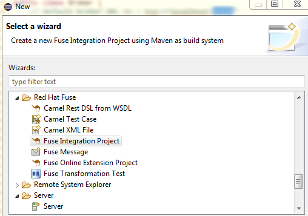
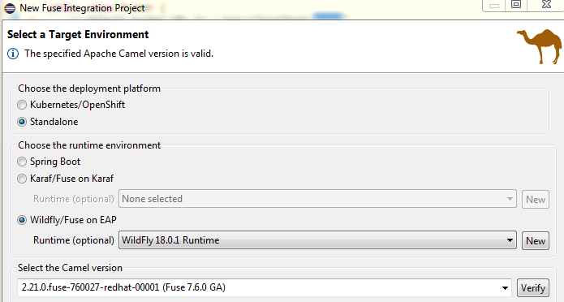
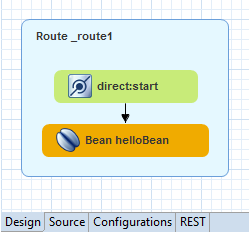
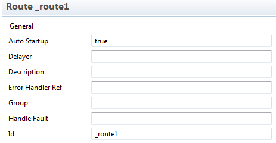
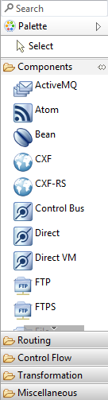
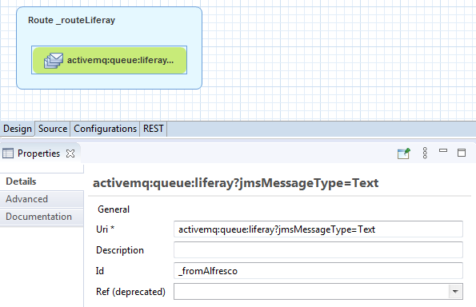
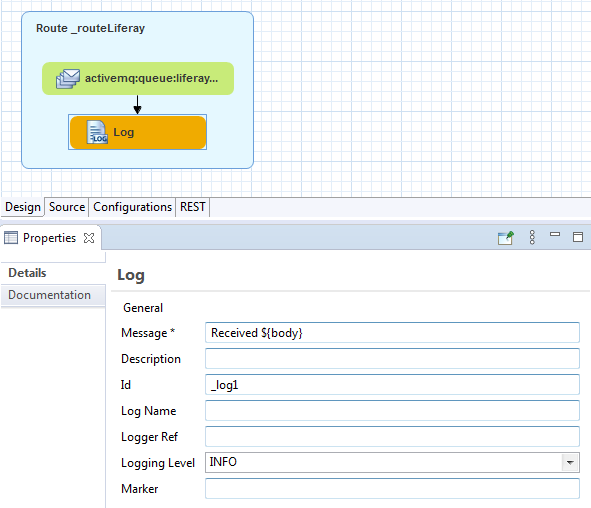
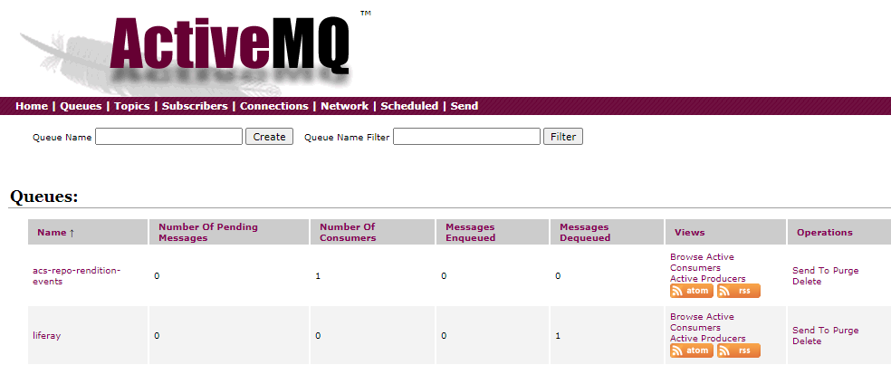

André Kreienbring, Cologne, June 2020

<br>
This work is licensed under the Creative Commons Attribution-ShareAlike 3.0 Unported License. To view a copy of this license, visit [http://creativecommons.org/licenses/by-sa/3.0/](http://creativecommons.org/licenses/by-sa/3.0/) or send a letter to Creative Commons, 444 Castro Street, Suite 900, Mountain View, California, 94041, USA.

[Leave the tutorial](../index.md)<br>
[Back to tutorial overview](index.md)<br>
[Back to Chapter 2: Sending a message from Alfresco to ActiveMQ](messagesending.md)

## Chapter 3: Getting started with Fuse
In the previous chapter we learned how we make Alfresco send messages to an ActiveMQ Queue. Now they are  waiting for further processing by Camel / Fuse.

We will set up a Fuse Integration Project with Eclipse and start building our route. Our first task is to cope with messages of the form
```
{
	"alfrescoID":"8d03bfbc-ed24-4f96-8c4a-fc8f333b7b37",
	"action":"create"
}
```
The message contains the Alfresco document ID and the action that we finally want to perform in Liferay.

### A new Fuse Integration Project
Start your Eclipse IDE and create a new Fuse Integration Project in the workspace.



Click *Next*, give the project a name of your choice and click *Next* again. Now this step is important:



Note the selections I made:
Red Had offers you to deploy the project to their Kubernetes / Openshift platform. This is surely a cool thing, but let's run it *standalone*.

For this tutorial, as described in the [Software Stack](softwarestack.md), I'll choose *Wildfly*

Red Hat requires you to *verify* the settings. After that you can click on *finish*. Now sit back and wait or get yourself a drink of your choice. Creating the project takes quite a while.

The reason it takes so long is probably that numerous Maven artifacts must be downloaded. Camel consists of countless so called [Enterprise Integration Points (EIP) or Components](https://access.redhat.com/documentation/en-us/red_hat_fuse/7.6/html/apache_camel_component_reference/components-overvew) and I guess a few of them are preloaded.

This is an important thing to realize. Every time you add a Camel Component to your project your Maven *pom.xml* eventually gets updated by the Route Designer and the artifacts are downloaded during the next Maven compile phase.

After your hard drive and your network connection survived the stress test you,ll see this:



because the project came with an example.

The route definition lives in a file called *jboss-context-xml* underneath the *Camel-Contexts* Folder of the new Project. To view the XML of that file simply change the mode of the editor from *Design* to *Source*.

```xml
<beans xmlns="http://www.springframework.org/schema/beans"
    xmlns:xsi="http://www.w3.org/2001/XMLSchema-instance" 
    xsi:schemaLocation="http://www.springframework.org/schema/beans 
    https://www.springframework.org/schema/beans/spring-beans.xsd 
    http://camel.apache.org/schema/spring https://camel.apache.org/schema/spring/camel-spring.xsd">
    <bean class="org.test.MyBean" id="helloBean"/>
    <camelContext id="spring-context" xmlns="http://camel.apache.org/schema/spring">
        <route id="_route1">
            <from id="_from1" uri="direct:start"/>
            <bean id="_bean1" ref="helloBean"/>
        </route>
    </camelContext>
</beans>
```

Note that Fuse generated the XML that Camel can understand. Also JAVA beans can be parts of Camel routes. We will use this in our own route to Liferay later. Remove the bean with the id *helloBean* and switch back to *Design*.

Simply hover over the two enclosed Camel components, and delete them mercilessly.

Click on the remaining blue route on the canvas and edit it's properties underneath the designer.



Change the id of the route to *_routeLiferay*, save the *jboss-context-xml*  and you're ready to go your own way.

### Receive an ActiveMQ message with Fuse
On the left of the Designer canvas you see the palette.



From here you can Drag & Drop Camel Components to your route.
Start by dragging the ActiveMQ Component and drop it onto the blue route component.
In the properties of the ActiveMQ component set the *Uri* to *activemq:queue:liferay?jmsMessageType=Text* and the *Id* to *_fromAlfresco*



Fuse does a real good job here. In the background it manipulates your *pom.xml* if needed, it generates the source XML of the Camel Context and it sets parameters. You can see this, if you click on the tabs in the *Advanced* properties. The parameters of the *Uri* have been inserted in the appropriate fields.

As a plus you can read the documentation of every component. 

### The Log Component
You'll find out that logging is very helpful. Camel works like this (in short):<br>
The object that goes through the route is called *exchange*. This object has a *body*, a *header* and it has *properties*.
Every component you have in the route gets (consumes) the *exchange*, does something to / with it and forwards (produces) it to the next component.

Drag & Drop the *Log* component from the palette directly onto the *ActiveMQ* component in your route. This connects them immediately. In the properties of the *log* set *Message* to *Received ${body}*



The output of the *Log* can later be found in the context that camel is running in. In our case that's the Wildfly Server log file. But before we can raise our glasses when we find the incoming message in the server log, we need to build the Fuse project and publish it to the Server.

### Compiling, publishing and running the Fuse Project.
I hope you're familiar with Eclipse, Maven and Server Runtimes. Because I'll not go into the details in this tutorial. Under the hood there are a lot of things happening during the process, but the short story is:

- Rightclick your Fuse project in the workspace
- Click on *Run As* -> *Run on Server*
- Select the Wildfly Server that we set up in the first chapter
- Switch to the Console view of Eclipse an watch your server starting and putting lots of stuff into the server log.

If you still have a message in the ActiveMQ Queue that we generated in chapter 2, then it should be immediately processed by the wildfly-camel subsystem and hence the JSON should be written into the servers log file. 

Also check the ActiveMQ *liferay* queue. After the message was consumed by Camel, it is dequeued and not pending anymore.



[Chapter 4.: Using CMIS to download a document from Alfresco](using_cmis_download.md)<br>
[Back to Chapter 2: Sending a message from Alfreso to ActiveMQ](messagesending.md)<br> 
[Back to tutorial overview](index.md)<br> 
[Leave the tutorial](../index.md)
