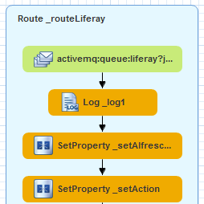
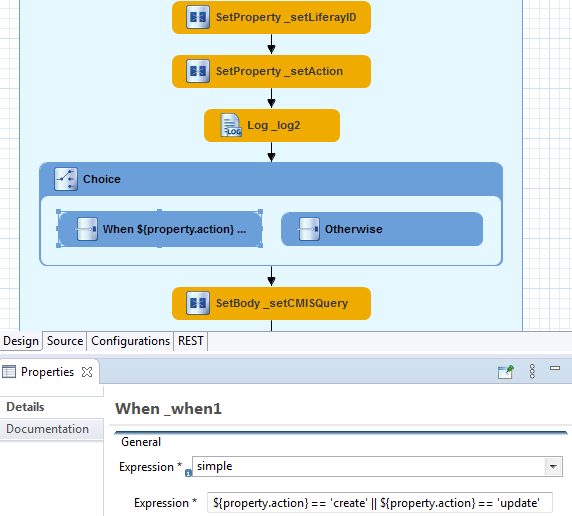
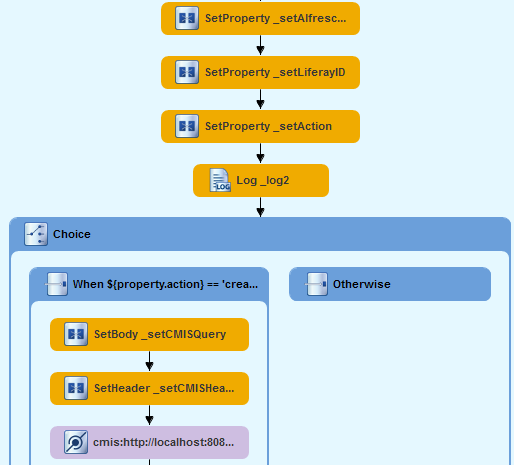

<br>
This work is licensed under the Creative Commons Attribution-ShareAlike 3.0 Unported License. To view a copy of this license, visit [http://creativecommons.org/licenses/by-sa/3.0/](http://creativecommons.org/licenses/by-sa/3.0/) or send a letter to Creative Commons, 444 Castro Street, Suite 900, Mountain View, California, 94041, USA.

[Leave the tutorial](../index.md)<br>
[Back to tutorial overview](index.md)<br>
[Back to Chapter 7: Implementing the C(R)UD behaviour](implement_crud.md)

## Chapter 8: Making decisions on the route
Up to this point our way was straight forward. We got a message of the form
```
{
	"alfrescoID":"8d03bfbc-ed24-4f96-8c4a-fc8f333b7b37",
	"action":"create"
}
```

and our route created the Alfresco document in Liferay and submitted the Liferay ID  of this document back to Alfresco.

But now messages can also look like this
```
{
	"alfrescoID":"8d03bfbc-ed24-4f96-8c4a-fc8f333b7b37",
	"liferayID":32607
	"action":"delete"
}
```
```
{
	"alfrescoID":"8d03bfbc-ed24-4f96-8c4a-fc8f333b7b37",
	"liferayID":32607
	"action":"update"
}
```
and the route has to make decisions.

### Making choices with When - Otherwise
The start of the route looks like this



As we need to grab the liferayID in a new property drop a new *Set Property* component from the palette precisely on the arrow between the existing *Set Property* components. Use the *jsonPath* expression *$.liferayID* to get it, set the property name to *liferayID* and the *Id* to *_setLiferayID*

If we "only" want to delete an existing Liferay document then we don't need to download things with CMIS. So the route forks directly after the *Log* component you see above.

I recommend making a backup of the *jboss-camel-context.xml* of your Fuse Integration Project at this point. Things can get a little bit hairy now...

Go to the *Routing* section of the palette and place a *Choice* component on the arrow after the *Log*. Then drop a *When* component (same section) on the choice. Next pick a *Otherwise* and also drop it on the *Choice*

Select the *When*, choose the simple language and set the expression to<br>
```${property.action} == 'create' || ${property.action} == 'update'```

(BTW: the jsonpath language works here as well. Then the expression would be<br> 
```$[?(@.action == "create" || @.action == "update")]```

At this point this part of your route should look like this



Everything behind the choice now needs to go to the *When* component. I must admit here, that I didn't find a convenient way to do this with the visual Designer of Fuse.

Instead look at the XML source of your route. The inserted Choice-When-Otherwise part look like this

```xml
<log id="_log2" message="Need to ${property.action} a document with id  ${property.alfrescoID}"/>
<choice id="_choice1">
   <when id="_when1">
      <simple>${property.action} == 'create' || ${property.action} == 'update'</simple>
   </when>
   <otherwise id="_otherwise1"/>
</choice>
<setBody id="_setCMISQuery">
---
--- the rest of the route is here
---
```

Now copy **everything** of the route, that is behind the closing ```</choice>```, to the ```<when>```. The result should be

```xml
<choice id="_choice1">
   <when id="_when1">
       <simple>${property.action} == 'create' || ${property.action} == 'update'</simple>
        <setBody id="_setCMISQuery">
            <simple>Select * from cmis:document WHERE cmis:objectId = '${property.alfrescoID}'</simple>
        </setBody>
	--- 
	--- the rest of the route goes here
	---   
   </when>
   <otherwise id="_otherwise1"/>
</choice>
```

If you switch back to design mode (hopefully) you got



If it doesn't, restore your backup and try again.

### Finalizing Delete
The rest of the work you'll need to do here would be a repetition of what we already did. Find out the REST request for the DELETE method on Liferay, setting the header, using the *HTTP4* component, etc.

Let's make it quick and dirty instead!

Look again at the XML source of your route and locate the ```xml<otherwise id="_otherwise1"/>``` block.
Change it to
```xml
<otherwise id="_otherwise1">
     <setHeader headerName="Authorization" id="_Liferay_Auth">
         <constant>Basic YWtyZWllbmJyaW5nQGdtYWlsLmNvbTphcHBsZXBpZQ==</constant>
     </setHeader>
     <toD id="_http4_delete_document" uri="http4://[yourHost]:[yourPort]/o/headless-delivery/v1.0/documents/${property.liferayID}?httpMethod=DELETE"/>
     <log id="_log6" message="${body}"/>
 </otherwise>
```

To be honest: This is way quicker then fumbling with the designer. But Fuse is still a great tool to work with. And mind the IDs! If you work directly on the XML source, be sure to have them unique!

### Finalizing Update
I guess you already know, that we need to do another *Choice* to get the update working. 
Let's think about where to insert it: For an update the content must be downloaded from Alfresco again. We need to make a request to the Liferay REST API with a *multipart / formdata* header again.  
So a good place to insert the next *Choice* into our route is clearly directly behind the *DocumentSender* bean. But instead of a POST request we need to make a PUT request here.
As that would be another repetition of all that we have learned up to this point, I would say that is a good homework for you. Or you just grab the [source XML](source/fuse/jboss-camel-context.xml) from the repo. ;-)

### Summary
Congratulations! Thank you for following me on the long journey from Alfresco to Liferay. The route we made was sometimes stony. Doing it with Camel / Fuse is surely a lot easier than coding everything yourself. 
Let me say that the countless languages (simple, jsonpath, ...) are a *babylonian challenge* for newbies! But, on the other hand, once you know how to handle them, this is an extremely powerful tool!

This Alfresco - Liferay integration was achieved by writing **only 20 lines of JAVA Code** (on the route), because Camel did the rest of the work. The route can easily be reused, or at least be the base, for different solutions that follow the CRUD pattern.

Now that's what I would call *Low-Coding* and the right way to invest time in.


[Route overview](route_overview.md)<br>
[Back to Chapter 7: Implementing the C(R)UD behaviour](prepare_crud.md)<br>
[Back to tutorial overview](index.md)<br>
[Leave the tutorial](../index.md)
