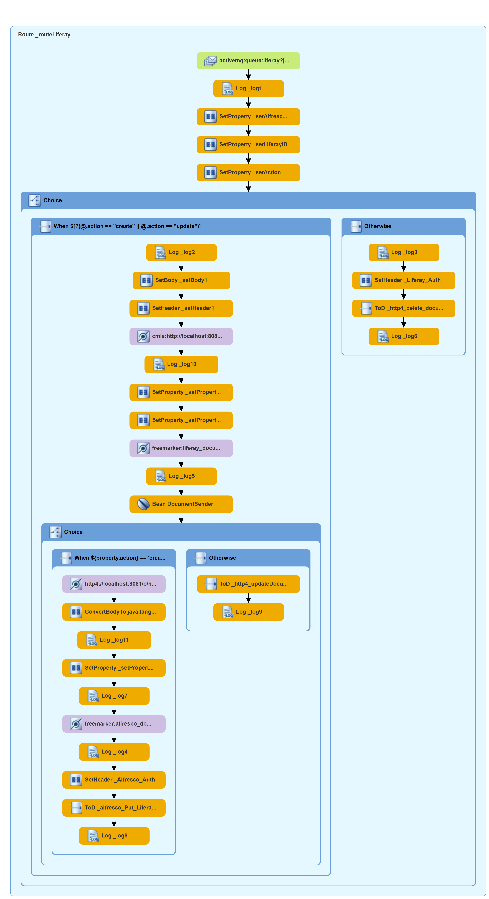

André Kreienbring, Cologne, June 2020

 
This work is licensed under the Creative Commons Attribution-ShareAlike 3.0 Unported License. To view a copy of this license, visit [http://creativecommons.org/licenses/by-sa/3.0/](http://creativecommons.org/licenses/by-sa/3.0/) or send a letter to Creative Commons, 444 Castro Street, Suite 900, Mountain View, California, 94041, USA.

[Leave the tutorial](../index.md) 
[Back to tutorial overview](index.md) 
[Back to Chapter 8: Making decisions on the route](making_decisions.md)

[Back to Chapter 8: Making decisions on the route](making_decisions.md)  
[Back to tutorial overview](index.md)  
[Leave the tutorial](../index.md)
