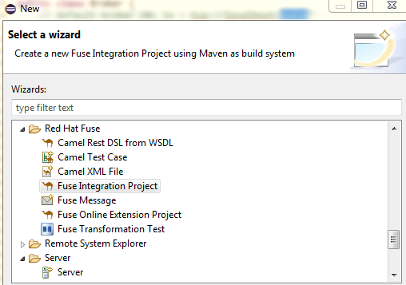
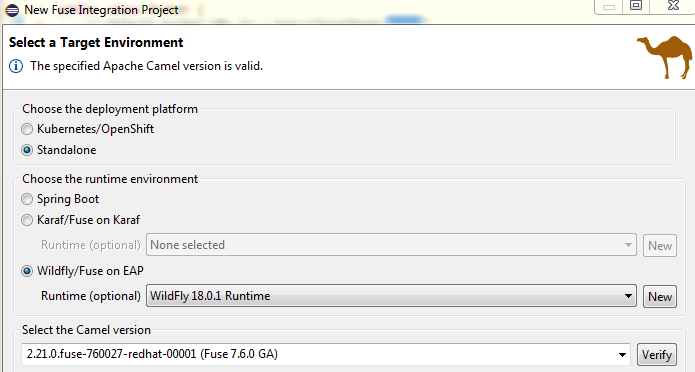

André Kreienbring, Cologne, June 2020

<br>
This work is licensed under the Creative Commons Attribution-ShareAlike 3.0 Unported License. To view a copy of this license, visit [http://creativecommons.org/licenses/by-sa/3.0/](http://creativecommons.org/licenses/by-sa/3.0/) or send a letter to Creative Commons, 444 Castro Street, Suite 900, Mountain View, California, 94041, USA.

[Back to the top](../index.md)<br>
[Back to tutorial overwiew](index.md)

## Chapter 3.: Getting started with Fuse
In the previous chapter we learned how we make Alfreso send messages to an ActiveMQ Queue. Now they are  waiting for further processing by Camel / Fuse.

We will set up a Fuse Integration Project with Eclipse and start building our route. Our first task is to cope with messages of the form
```
{
	"alfrescoID":"8d03bfbc-ed24-4f96-8c4a-fc8f333b7b37",
	"action":"create"
}
```
The messages holds the Alfresco document ID (of type whitepaper) and the action that we finally want to perform in Liferay.

## A new Fuse Integration Project
Start your Eclipse IDE and create a new Fuse Integration Project in the workspace.



Click *Next*, give the project a name of your choice and click *Next* again. Now this step is important:



Note the selections I made:
Red Had offers you to deploy the project to their Kubernetes / Openshift platform. This is surely a cool thing, but let's run it *standalone*.

For this tutorial, as described in the [Software Stack](softwarestack.md), I'll choose *Wildfly*

Red Hat requires you to *verify* the settings. After that you can click on *finish*. Now sit back and wait or get yourself a drink of your choice. Creating the project takes quite a while.

The reason it takes so long is probably that numerous Maven artifacts must be downloaded. Camel consists of countless so called [Enterprise Integration Points (EIP) or Components](https://access.redhat.com/documentation/en-us/red_hat_fuse/7.6/html/apache_camel_component_reference/components-overvew) and I guess a few of them are preloaded.

This is an inportant thing to realize. Every time you add a Camel Component to your project your projects *pom.xml* eventually gets updated by the Route Designer and the artifacts are downloaded during the next Maven compile phase.


[Back to tutorial overwiew](index.md)<br> 
[Back to the top](../index.md)
