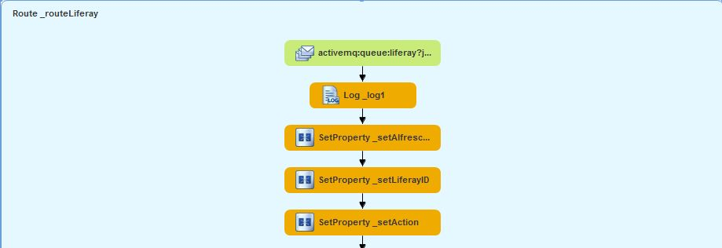
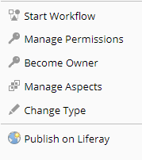
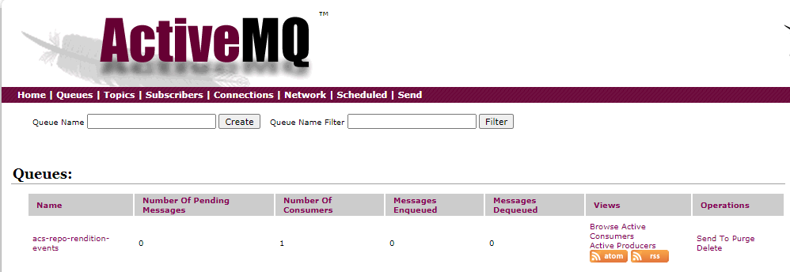
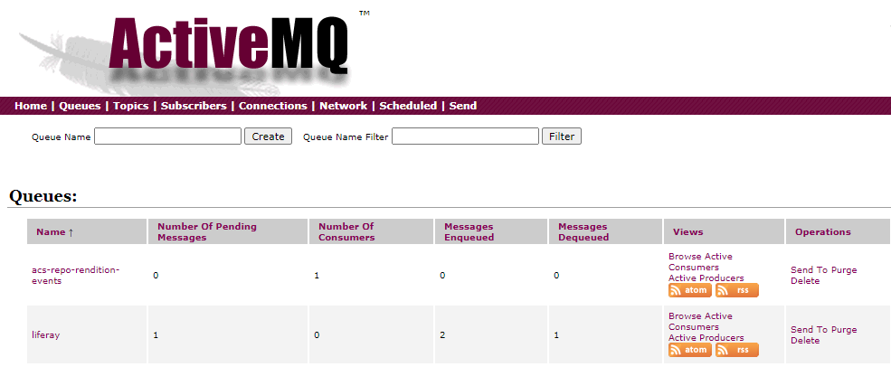

André Kreienbring, Cologne, June 2020

<br>
This work is licensed under the Creative Commons Attribution-ShareAlike 3.0 Unported License. To view a copy of this license, visit [http://creativecommons.org/licenses/by-sa/3.0/](http://creativecommons.org/licenses/by-sa/3.0/) or send a letter to Creative Commons, 444 Castro Street, Suite 900, Mountain View, California, 94041, USA.

[Back to the top](../index.md)<br>
[Back to tutorial overwiew](index.md)

## Chapter 2.: Sending a message from Alfreso to ActiveMQ
Our route to Liferay starts when the Camel middleware receives a ActiveMQ message. More on the route later...


Therefor we need to do something within Alfreso.


### Now it's time to write some JAVA code. 

Remember the [Developing custom Actions tutorial](https://ecmarchitect.com/alfresco-developer-series-tutorials/actions/tutorial/tutorial.html) from the [Alfresco Developer Series](https://ecmarchitect.com/alfresco-developer-series)?



That gave us 3 new actions in Alfreso 
1. *set-web-flag* 
2. *enable-web-flag*
3. *disable-web-flag*

I just relabled them (like some other things too) to make clear what we are here for.

What you see in the picture enables the web flag when you (could) click on it. The latter two actions extend the *set-web-flag* ActionExecuter. So let's put the central logic that handles messages there.

Remember that the Alfresco GUI is configured on the Share-Tier, whereas the implemantaion of the actions was done on the Repository-Tier. Clearly we need to change the code in the respective classes of the Repository-Tier.

As you can download the code from this repository, I will not post the whole code here. Just the main and important changes I made to the

**SetWebFlag.java class**
```Java			
import platform.activemq.Sender;

...
...
...

if (activeFlag) {
	// set the bi:published property to now
	properties.put(QName.createQName(BInformedModel.NAMESPACE_BINFORMED_CONTENT_MODEL, 
		BInformedModel.PROP_PUBLISHED), justNow);
				
	//Crate a activemq message
	message = 
		"{\r\n" + 
		"	\"alfrescoID\":\"" + actionedUponNodeRef.getId() + "\",\r\n" +
		"	\"action\":\"create\"\r\n" +
		"}";
}else {
	// reset the properties
	properties.put(QName.createQName(BInformedModel.NAMESPACE_BINFORMED_CONTENT_MODEL, 
		BInformedModel.PROP_PUBLISHED), null);
				
	message = 
		"{\r\n" + 
		"	\"alfrescoID\":\"" + actionedUponNodeRef.getId() + "\",\r\n" +
		"	\"action\":\"delete\"\r\n" +
		"}";
}
			
Sender.send(message);
```

Don't let confuse you because I used different namespaces when I did the tutorial. It's always a good practice when you want to set them back to the SomeCo originals. The same is true for the package names. 

What is done here is rather simple. We create a JSON message depending on the state of the isActive Web Flag. For example:
```
{
	"alfrescoID":"8d03bfbc-ed24-4f96-8c4a-fc8f333b7b37",
	"action":"create"
}
```
where *alfrescoID* is the unique ID of the document node and the *action* is the action we want to perform in Liferay.
And finally we send this JSON to ActiveMQ with the Sender class.

### The ActiveMQ Sender
On the top of the JAVA file I import the Sender class. So let's see what that is.

ActiveMQ receives, stores and transports messages using various protocols, but that is a different tutorial. The important thing here is that there are two different messaging concepts:

#### The Queue
When you send a message to an ActiveMQ Queue, then it is directed to a message consumer that listens to that Queue (one-to-one)

#### Topic
When you send a message to an ActiveMQ Topic, then it may be consumed by all consumers that subcribed to the topic (publish-subscribe or one-to-many)

I hope you already now get an idea of the potential of this pattern over the one-to-one REST approach we discussed in the beginning.

However, we will use a Queue for our purpose and have a look on the 

**Sender.java class**
```
package platform.activemq;

import javax.jms.Session;
import javax.jms.TextMessage;

import org.apache.commons.logging.Log;
import org.apache.commons.logging.LogFactory;

import javax.jms.MessageProducer;
import javax.jms.JMSException;
 
public class Sender {
     private static Log logger = LogFactory.getLog(Sender.class);
     public static void send(String messageToSend) throws JMSException {        
	try {

		Session session = Broker.getSession();
		MessageProducer producer = Broker.getMessageProducer();  

		TextMessage message = session.createTextMessage(messageToSend);

		// Here we are sending our message!
		producer.send(message);

		logger.info("Sent '" + message.getText() + "'");
	} catch (Exception e) {
		logger.error("Couln't send a message to ActiveMQ");
		e.printStackTrace();
	}
    }
}
```

Because Alfresco uses ActiveMQ out-of-the-box you should not need to do any Spring XML fuddelings to be able to import the needed framework.

Looks rather easy... but have a look at the *Broker* Class that does some important things for us.

### The ActiveMQ Broker
As ActiveMQ is a separate Server (that by default listens to incoming messages on the TCP port 61616) the Broker will set up a connection to it, create a Queue named *liferay* and, even more important, reuse things to save our ressources. 
If you look into the code, you will see that Connection, Session and MessageProducer can be reused when sending messages.

### Time for a first Test
At this point, after you implemented the above code, let's get a taste of the fruits we're raising.
You know what you need to do:
- Deploy the Alfresco Repository Module
- Fire up your server(s) 
and then point your Browser to your ActiveMQ Webinterface (In my case that is the default: `http://localhost:8161`)

Navigate to the Queues View. It shows an Alfresco internal route and will probably look like this:




Next click go to Alfresco Share and to the repo folder where you stored your whitepapers.
Recall from Jeffs tutorial that you may have to change the type of documents to *whitepaper* and add the *webable* aspect to the content. Now you should see the *Publish to Liferay* button.


Take a deep breath and click on it.

Now ActiveMQ should present you the new Queue with one message in it. Inspect the message. It should contain the *create* action and the *alfresoID*. When it all worked, then your are ready to consume this message from Camel in the next step.




[Back to tutorial overwiew](index.md)<br> 
[Back to the top](../index.md)

