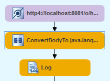
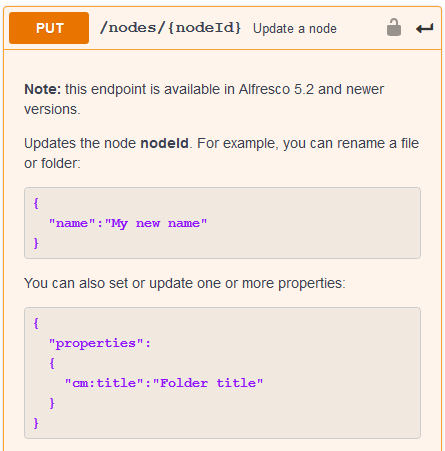
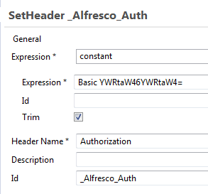
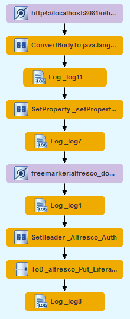

<br>
This work is licensed under the Creative Commons Attribution-ShareAlike 3.0 Unported License. To view a copy of this license, visit [http://creativecommons.org/licenses/by-sa/3.0/](http://creativecommons.org/licenses/by-sa/3.0/) or send a letter to Creative Commons, 444 Castro Street, Suite 900, Mountain View, California, 94041, USA.

[Leave the tutorial](../index.md)<br>
[Back to tutorial overview](index.md)<br>
[Back to the previous chapter](upload_content_liferay.md)

## Chapter 6.: Preparations for C(R)UD
In the the previous chapter we successfully created a Alfresco document in Liferay. If the document is updated / deleted in Alfresco it must also be updated / deleted in Liferay.
That is the idea of CRUD Create-Read-Update-Delete. 

We don't have to read from Liferay in our scenario, but thinking about Update / Delete it gets clear, that we need to store the ID of the Liferay document in Alfresco.

In this chapter we will adjust the content model of Alfresco to store an external ID with a document. After that we will get the Liferay ID from the JSON response of the upload and update the Alfresco document with this ID.

### Extend the Alfresco content model of Whitepapers
During the development of the [SomeCo Module](https://ecmarchitect.com/alfresco-developer-series-tutorials/content/tutorial/tutorial.html) a new type "Whitepaper" was created in the Alfresco Repository tier. Also a new aspect "webable" with the properties "isActive" (boolean) and "published" (date) was added.

For beeing able to store the Liferay ID with a *webable Whitepaper* this aspect needs to be extended like this:
```xml
<aspect name="sc:webable">
   <title>Someco Webable</title>
   <properties>
       <property name="sc:published">
           <type>d:date</type>
        </property>
        <property name="sc:isActive">
            <type>d:boolean</type>
            <default>false</default>
        </property>
        <property name="sc:externalID">
            <type>d:int</type>
        </property>
   </properties>
</aspect>
```

It's also a good idea to have this properties in the corresponding JAVA class for later usage:
```java
public static final String PROP_PUBLISHED = "published";
public static final String PROP_IS_ACTIVE = "isActive";
public static final String PROP_EXTERNALID = "externalID";
```

That's it for the Repository tier.

Adding the new Property on the Share tier (GUI) is not necessary but helpful during the development process.

Edit your *share-config-custom.xml* 

```xml
<config evaluator="model-type" condition="sc:whitepaper">
   ---
   ---
   <field-visibility>
      ---
      ---
	   <!-- sc:webable -->
	   <show id="sc:isActive" />
      <show id="sc:published" />
	   <show id="sc:externalID" />
   </field-visibility>
   <appearance>
      ---
      ---
		<!-- sc:webable -->
		<field id="bi:isActive" label-id="prop.sc_isActive">
			<control template="/org/alfresco/components/form/controls/checkbox.ftl" />
		</field>
		<field id="sc:published" label-id="prop.sc_published">
			<control template="/org/alfresco/components/form/controls/daterange.ftl" />
		</field>
		<field id="sc:externalID" label-id="prop.sc_externalID">
			<control template="/org/alfresco/components/form/controls/textfield.ftl" />
		</field>
   </appearance>
   ---
   ---
</config> 

<config evaluator="aspect" condition="sc:webable">
	<forms>
		<form>
			<field-visibility>
				<show id="sc:published" />
				<show id="sc:isActive" />
				<show id="sc:externalID" />
			</field-visibility>
			<appearance>
			   <field id="sc:published" label-id="prop.sc_published" />
			   <field id="sc:isActive" label-id="prop.sc_isActive" />
			   <field id="sc:externalID" label-id="prop.sc_externalID" />
			</appearance>
		</form>
	</forms>
</config>
```

Finally add the missing label to the corresponding *scModel.properties*
```
#sc:webable
aspect.sc_webable=SomeCo Webable
prop.sc_published=Published
prop.sc_isActive=Active?
prop.sc_externalID=Liferay ID
```
Now we are ready to store the Liferay ID in the Alfresco content mode as soon as we uploaded it.

### Get the Lifray ID from the POST response
If you look closely to the JSON response in your server log then you'll notice (shortened)
```json
{
  "id" : 36101
}
```

Thats the ID that Liferay assigned to the document when it was created. (Of course your value is different...)

But before we can extract the value into a exchange property we are facing a challenge here. The *Log* component after the *HTTP4* component consumed the response from the POST request. Because that response was a stream it is not in the exchange body anymore. 

One way to prevent that would be to [enable stream chaching](https://camel.apache.org/manual/latest/stream-caching.html) for the route, but let me show you another way. 

Get a *convert Body to* component from the *Transformation* section of the palette and drop it on the little arrow between the *HTTP4* and the *Log* component. Then set the *Type* property of this component to *java.lang.String*.



This little trick solves the mystery of the lost body!

Now you're able to get the ID with a *Set Property* component by using jsonpath *$.id*. Name this propertie *liferayID*

Why not drop another *Log* in the route that prints us *Need to add liferayID (${property.liferayID}) to Alfresco document with id  ${property.alfrescoID}* in the server log? It's allways helpfull to see if everything we need is in place.

In my case the output was:<br>
*Need to add liferayID (36207) to Alfresco document with id  67e6252d-7b89-4bdc-ab19-82ac75b0dbf4*

OK, but how do we do that? Of course with another REST call. This time to Alfresco!

Again we trust Swagger Hub and find:



The second example is what we want. To create the body of the PUT request, we quickly use the Freemarker component again. 
Create ```[Your fuse integration project]/src/main/java/alfresco_document.put.ftl```

The content is like so
```
{
	"properties":{
		"sc:externalID":${exchange.properties.liferayID?string.computer}
	}
}
```
What did I say about many different languages when using Camel? Here's another example. This is the Freemarker template specific language to access the exchange properties. And without the *?string.computer* our number *36207* would have been converted to *3.6207*.
If you want to know more about it, feel free to study the [Freemarker Template Language Reference](https://freemarker.apache.org/docs/ref_builtins_number.html)

The PUT request is a lot easier to generate then the previous POST to Liferay because it doesn't need a *multipart / form* element in the body. And remember that the Freemarker component already generated the requiered JSON in the exchange body for us.

But, again, an Authorization Header must be set. Drop a *Set Header* component on the Freemarker component.



This time you need to Base64 encode your Alfresco credentials in the form ```"username:password``` to get this working.
 
The last step is to fire the request with the *HTTP4* component. Get one by using the *Generic* one again and set the *Uri* to 
*http4://[myHost]:[myPort]/alfresco/api/-default-/public/alfresco/versions/1/nodes/${property.alfrescoID}?httpMethod=PUT*

The *Id* goes to *_alfresco_Put_LiferayID*

STOP! Not so quick! We need another little not-so-obvious trick here.
The *HTTP4* does **not** replace the property out of the box.

Switch your Fuse Designer to Source mode and locate the following XML:
```xml
<to id="_alfresco_Put_LiferayID" uri="http4://[myHost]:[myPort]/alfresco/api/-default-/public/alfresco/versions/1/nodes/${property.alfrescoID}?httpMethod=PUT"/>
```

Now replace the harmless looking *to* at the beginning with *toD*

The [Camel documentation of *toD*](https://camel.apache.org/components/latest/eips/toD-eip.html) sais:

*There is a new ```.toD / <toD>``` that allows to send a message to a dynamic computed Endpoint using one or more Expression that are concat together. By default the Simple language is used to compute the endpoint.*
	
which is what we need here.

One last *Log* component that logs the exchange body (The response to the PUT request) to the server log and you're ready to start your engines again.

### The result of our Work in this chapter
In the server log you see the JSON response (shortened):
```
{"entry":
	-- bla bla
	-- bla bla
	"properties":{
		"sc:isActive":true,
		"sc:published":"2020-06-04T11:26:30.913+0000",
		"sc:externalID":36207
	}
}
```

Your route (from the Liferay POST to the Alfresco PUT request):



But the most important result can be seen in Alfresco, when you click on the whitepaper you just published.<br>
The LiferayID gets now stored on the document properties.

<br>
[Back to tutorial overview](index.md)<br>
[Leave the tutoral](../index.md)
