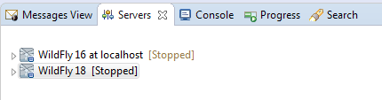
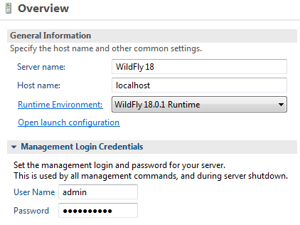
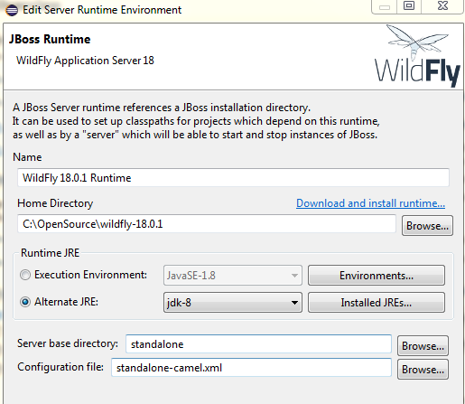

André Kreienbring, Cologne, June 2020

 
This work is licensed under the Creative Commons Attribution-ShareAlike 3.0 Unported License. To view a copy of this license, visit [http://creativecommons.org/licenses/by-sa/3.0/](http://creativecommons.org/licenses/by-sa/3.0/) or send a letter to Creative Commons, 444 Castro Street, Suite 900, Mountain View, California, 94041, USA.

[Back to the top](../index.md) 
[Back to tutorial overwiew](index.md)

## Chapter 1.: The Software Stack

### Yes! Versions are crucial!
Believe me, I suffered a lot when I was thinking *Hey, cool, a newer version is available. Let's use that one.* On the other hand: if you find out that things are still working or might even improve, be sure to let me know!

## Alfresco
Following Jeffs tutorial, at this point you have already installed Alfresco 6.2 (probably on Tomcat 8.5) and the Alfresco SDK 4.1.0 (based on Maven, which is version 3.6.3 for me).
As Alfresco needs ActiveMQ, we don't need to talk about it. I'm running ActiveMQ 5.15.12.
It doesn't matter for the tutorial, but I installed Alfresco on PostGres 11.7.2.

## Liferay and what Application Server to use
As the time of this writing I've installed [Liferay 7.3.2 GA3](https://sourceforge.net/projects/lportal/files/Liferay%20Portal/7.3.2%20GA3/). This version is compatible with Tomcat 9. And it was **not** a good idea to run Alfresco on Tomcat 9. (Took me hours to find out, that it is simply not working...)
Liferay 7.3.2 is also compatible with Wildfly 16.0.0. Being bravehearded I installed it on [Wildfly 18.0.1](https://wildfly.org/downloads/) and luckily until now it did not complain.
BTW: I'm running Liferay on MySQL 8.

## Wildfly-Camel Subsystem
There are numerous ways to run Camel. Standalone, with Springboot... and with the [Wildfly-Camel Patch](https://github.com/wildfly-extras/wildfly-camel/releases). I decided for the latter because the Version 11.0.1 is suited for Wildfly 18.0.1. and comes with Camel 2.25.0

You may think *You're fainthearded. There's this new and shiny version 11.1.0 that even supports Camel 3.1.0!*

Until you realize that...

## Red Hat Fuse
...supports only Camel 2.21.0 as of the day I'm writing this. Let me save you some time, admitting that I tried and failed because Camel 3+ has breaking changes regarding the syntax of the XML routes.

Red Hat Fuse is basically a visual designer for camel routes. Again here are more than one option to use it. I went with Eclipse 2020-3 by installing it from the latest [Red Hat Codeready Studio (formerly Developer Studio)](https://marketplace.eclipse.org/content/red-hat-codeready-studio-formerly-developer-studio).

## Get the correct Wildfly Runtime Environment
Red Hat provides different Eclipse Runtime Environments for their Wildfly Server Versions.

Add the Server View to your Eclipse Workspace and add a new Server to it. If you can, select the Wildfly 18.0.1 Runtime. If not select another Wildfly Runtime.

Doubleclick on the Server in the Server view.

You'll see something like this.

Click on *Runtime Environment* and you'll get

Here you can install the *Wildfly 18.0.1 Runtime* if it's missing on your system.

Note the *Configuration File* setting. *standalone-camel.xml* came with the mentioned *Wildfly-Camel subsystem* and must be selected here.

## A word on the JAVA Version
The most basic thing to have for everything we do here.
I worked with OpenJDK 1.8 and 11 and had no noteable problems.
Alfresco 6.2 officially [requires JAVA 11](https://docs.alfresco.com/6.2/concepts/supported-platforms-ACS.html) and Liferay claims that [it can run on both platforms](https://help.liferay.com/hc/en-us/articles/360028982631-Liferay-DXP-7-3-Compatibility-Matrix).

## Finally
Now you should be ready to go. Despite of the Version Hell!

[-> Chapter 2.: Sending an ActiveMQ message from Alfresco](messagesending.md)
[<-Back to tutorial overwiew](index.md) 
[<--Back to the top](../index.md)
