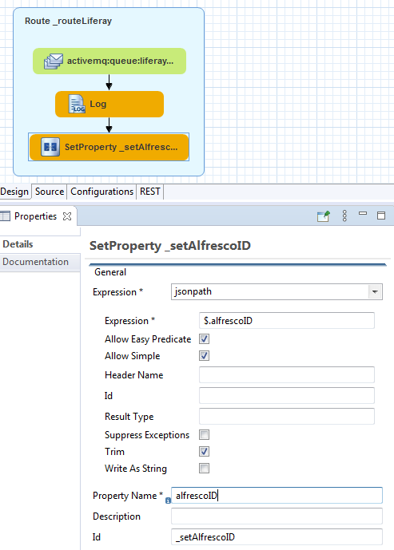
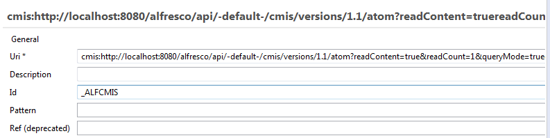
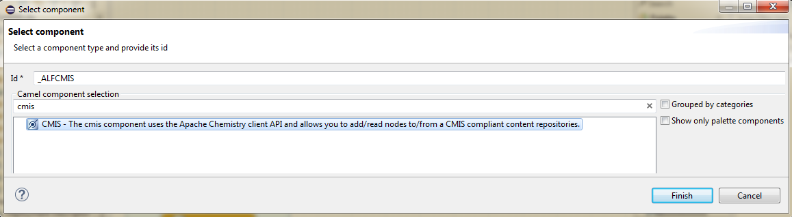

<br>
This work is licensed under the Creative Commons Attribution-ShareAlike 3.0 Unported License. To view a copy of this license, visit [http://creativecommons.org/licenses/by-sa/3.0/](http://creativecommons.org/licenses/by-sa/3.0/) or send a letter to Creative Commons, 444 Castro Street, Suite 900, Mountain View, California, 94041, USA.

[Back to the top](../index.md)<br>
[Back to tutorial overview](index.md)<br>
[Back to the previous chapter](getting_started_fuse.md)

## Chapter 4.: Using CMIS to download a document from Alfresco
Having the ID of an Alsfresco document in the server log file is not yet what we want. We need to download it to be able to upload it to Liferay later on.

One way to do this is the Camel-CMIS component that can be added to our route. 
But first we need to extract the information from the JSON message.

### From JSON text to exchange properties
```json
{
	"alfrescoID":"8d03bfbc-ed24-4f96-8c4a-fc8f333b7b37",
	"action":"create"
}
```

JSON and XML are both very handy when one needs to extract information from the text. For XML there's XPATH and for JSON there's JSONPATH. What a luck that these languages are included in Fuse. Let's see how simple that is.

Go back to the Design mode of your route and drop a *Set Property* component on the *Log* component. It is hidden in the Transformation section of the palette. Select *jsonpath* from the (first) Expression dropdown and make the settings like below.



As we need also the action from the message, drop another *Set Property* on the first one and adjust the settings accordingly.

The result here is, that we have set two properties on the *exchange* object that is passed through the whole route. The *body* of the exchange object holds the message that we got from ActiveMQ.

Note: I recommend setting properties' you'll need later' as early as possible in the route. The reason is that some components manipulate / delete the *exchange body*. This is for example the case if the *body* holds data that was streamed from somewhere. Like the response of a REST request. Streamed content can only be accessed once.

Drop another *Log* component and set the message to:
*Need to ${property.action} a document with id  ${property.alfrescoID}

Here you see how the properties can be retrieved from the exchange object. What's not so obvious is that the so called *simple* language is used here. Camel supports a couple of languages and sometimes it's not so easy to decide which one to use and how to apply them exactly.

### Using the Camel-CMIS component
I had a hard fight with this component. At first it looks harmless




Looks like setting the Alfresco CMIS url and the query with the extracted alfrescoID is all it needs to happily download things.

Nope! 



[Back to the previous chapter](getting_started_fuse.md)<br>
[Back to tutorial overview](index.md)<br>
[Leave the tutoral](../index.md)
